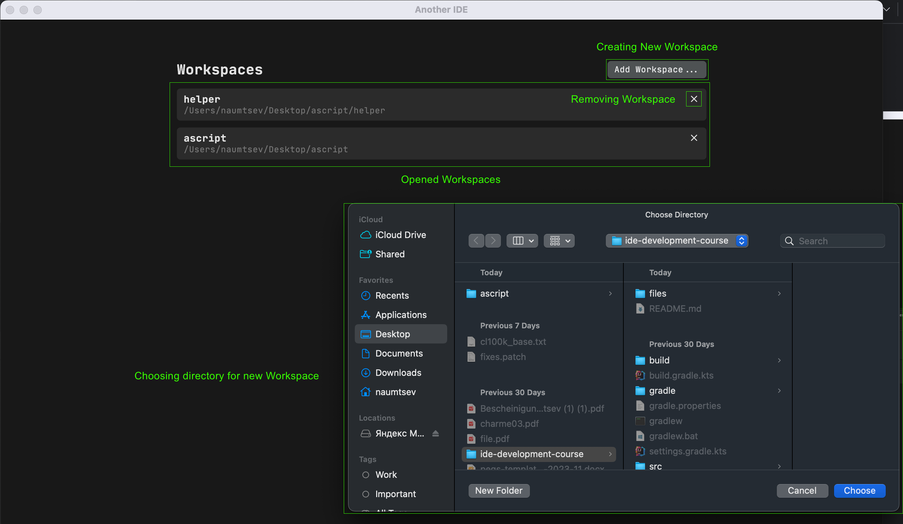

# Another IDE

"Simple IDE for editing text"

Source 1. Demo video

# Workspaces Viewer

Source 2. Workspaces Viewer

### Functionalities:
- Add / Remove Workspace
- Open Existing Workspaces

# Editor

Source 3. CodeView (Workspace)

### Functionalities:

- Files Tree
  - Displaying structure of files
  - Opening and navigation to editor by click on file
  - Updating tree when files appearing/disappearing in user file system
- Editor
  - Editing text
  - Highlighting text in files with .ascript extension
  - Buffered Text Displaying (supported only for lines)
- List of opened files
  - On click open selected file
-  Caret:
   -   Selection:
       - Replacing text
       - Deleting text
   - Moving:
       - By keys
       - By mouse
-  Shortcuts
   - Copy text
   - Paste text
   - Extract text
   - Save file
- Notification
   - Shows message of successful/failed saving and opening files
- Cursor Offset Tracker
- Gutters 